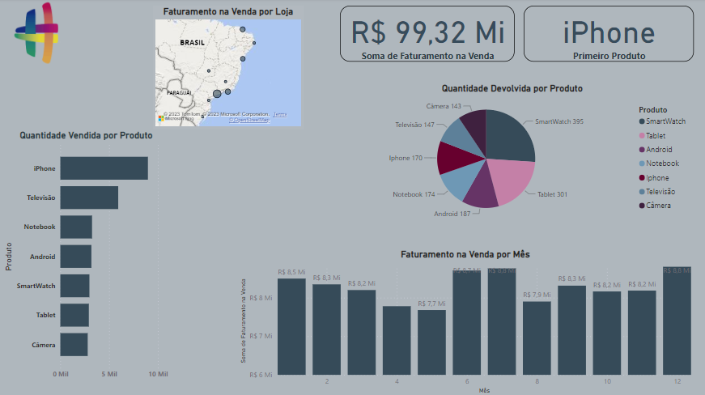
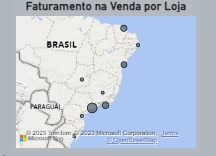
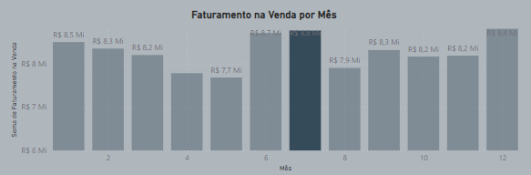
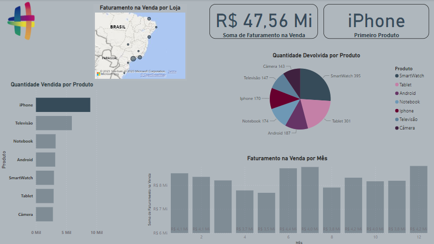
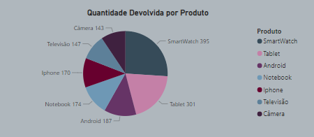

# Análise de Faturamento com Power BI

Análise diagnóstica de faturamento, vendas e devoluções de produtos eletronicos de uma rede de lojas fictícias com propósito de aprimorar conhecimentos em Power BI através de conteúdos disponibilizados pela @HashtagTreinamentos.

Os dados foram retirados de um arquivo CSV, limpos, tratados e carregados no Power BI de forma a resultar no dashboard apresentado.
Com a análise, podemos tirar alguns insigths como:
Visualizar o faturamento geral da empresa e quais são as lojas com maior faturamento:

Quais os produtos que mais vendem, por loja e período:

Faturamento por produto:

Índice de devolução por produto:

